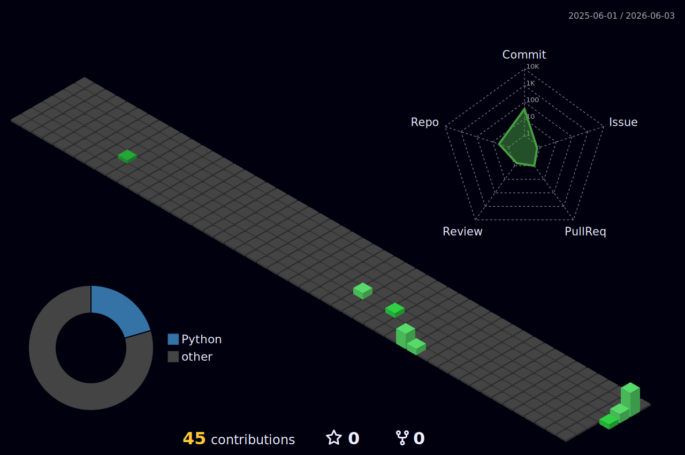

  

  

<h2 align="center">👋 About Me</h2>

  

  I'm an aspiring <b>Machine Learning Engineer</b> with a deep passion for the entire ML spectrum. My primary focus is on building a strong foundation in <b>Classical Machine Learning</b> and <b>Deep Learning</b>. I believe in a serious, focused, and detail-oriented approach to work — quality execution is my priority.

<h2 align="center">🔭 Currently Working On</h2>

  • Developing a <b>trading engine core</b> for cryptocurrency exchanges — a high-performance backend system for automated trading. 
  • Continuously learning and building personal projects to solidify my ML/DL knowledge.

<h2 align="center">🛠️ Tech Stack</h2>

  

<h2 align="center">🌐 3D Contribution Graph</h2>

  

<h2 align="center">📫 How to Reach Me</h2>

  
  

  <i>I'm actively learning and open to interesting ideas, collaborations, or mentorship opportunities in the field of Machine Learning.</i>

  
   
  <i>Powered by 🌰 Kurimanju</i>

